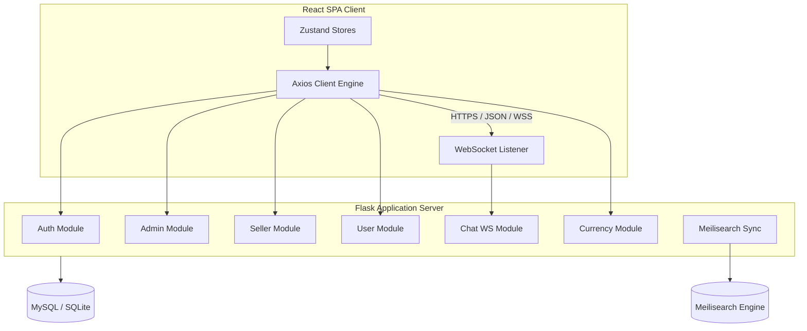

# System Architecture Documentation

This document describes the architectural layout, design patterns, and engineering decisions behind the ShopHub codebase.

---

## 🏛️ Monolith Modular Design

ShopHub is designed as a **Modular Monolith**. Rather than separating services into distinct microservices—which introduces network latency, serialization overhead, and deployment complexity—all logical modules live inside a single deployment unit while maintaining high cohesion and loose coupling.

Each backend module has its own route blueprint registered in [shop/__init__.py](file:///home/hardik/Technotery/Project/live_Rotation_token_e-commerce_project-main/shop/__init__.py). They communicate with the shared database layer using SQLAlchemy ORM models.

---

## 🔑 Security & Token Lifecycle

Authentication is built around security boundaries that mitigate risk from scripts (XSS) and cross-origin attacks (CSRF):

1. **Authentication State**: Handled using two JSON Web Tokens (Access and Refresh) stored in `HttpOnly`, `Secure` cookies.
2. **Access Token Lifetime**: Short-lived (15 minutes).
3. **Refresh Token Lifetime**: Long-lived (7 days).
4. **CORS Configuration**: Restricted allowed origins. Cross-origin cookies are secured via `SameSite=Lax` and CORS credentials validation rules.

---

## 🔄 Search Engine Sync Logic

Product searching leverages **Meilisearch** to support fuzzy search queries in under 5ms. 
- **Initialization**: The configuration runs idempotently on app launch using `configure_index` inside [shop/search/client.py](file:///home/hardik/Technotery/Project/live_Rotation_token_e-commerce_project-main/shop/search/client.py).
- **Synchronization**: The sync script [sync_search.py](file:///home/hardik/Technotery/Project/live_Rotation_token_e-commerce_project-main/sync_search.py) extracts current database listings, maps them to JSON search structures, and pushes them to Meilisearch indexing.

---

## 🪙 Currency Store Mechanics

Exchange rates are refreshed periodically via the `currency` module. 
- Rates are fetched from a public provider API, cached in memory/Redis to prevent rate-limit bans, and updated on the fly using Zustand actions (`currencyStore.ts`).
- Dynamic formatting handles conversion and symbol resolution dynamically on the client, maintaining pricing consistency across checkout.
